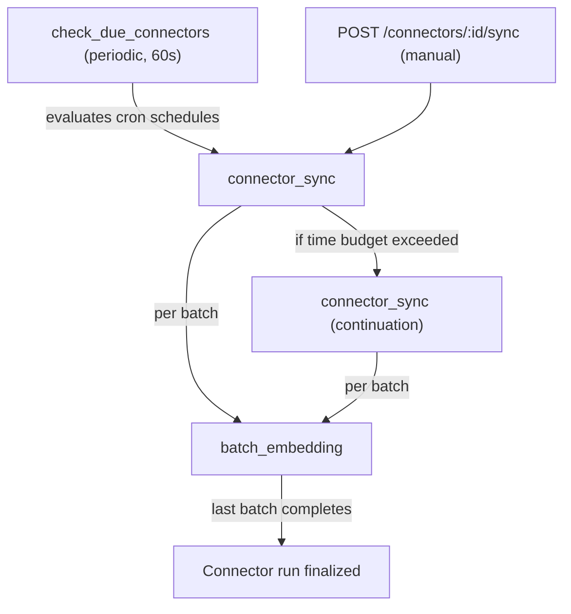

<!--
Check ../docs_writer_prompt.md before changing this file.

This is a developer reference for the internal sync pipeline. It covers task orchestration, data flow, state transitions, and database tables.
-->

## Sync Pipeline Overview

A connector sync moves data from an external tool into searchable vector chunks. The pipeline has three stages: **scheduling**, **ingestion**, and **embedding**. Each stage is a separate task in a Postgres-backed queue, connected by enqueue calls.



## Task Types

All tasks use the `tasks` table with `task_type` discriminating the handler.

### `check_due_connectors`

Periodic task, runs every 60 seconds. For each enabled connector, evaluates the cron `schedule` field. If due and no `connector_sync` task is already pending/processing for that connector, enqueues one. Also cleans up orphaned connectors stuck in `running` status with no active task or run.

### `connector_sync`

Payload: `{ connectorId, continuationCount? }`

1. Loads connector config, KB assignments, and credentials (from secrets manager).
2. Creates a `connector_runs` record with status `running`.
3. Calls `estimateTotalItems()` on the connector for progress display.
4. Iterates the connector's `sync()` async generator. Each yield produces a `ConnectorSyncBatch` containing documents, failures, a checkpoint, and a `hasMore` flag.
5. For each document in the batch:
   - Looks up existing doc by `(connector_id, source_id)`.
   - Compares SHA-256 content hash. Skips unchanged documents.
   - Upserts into `kb_documents`, chunks content, stores chunks in `kb_chunks`.
6. Enqueues a `batch_embedding` task for ingested document IDs.
7. Updates `connector_runs` progress counters and saves the checkpoint on the connector.
8. Checks time budget. If elapsed time exceeds 90% of `maxDurationMs`, stops iteration and marks the run as `partial`.

On `partial` status, the handler enqueues a continuation `connector_sync` with `continuationCount + 1`. Max 50 continuations per initial sync.

### `batch_embedding`

Payload: `{ documentIds, connectorRunId }`

Generates vector embeddings via the embedding service and stores them in `kb_chunks.embedding`. Increments `completed_batches` on the connector run. When `completed_batches == total_batches`, finalizes the run -- sets status to `success` or `completed_with_errors` (if `item_errors > 0`) and updates `last_sync_at` / `last_sync_status` on the connector.

## State Transitions

### Connector `last_sync_status`

```
null ──> "running" ──> "success"
                   ──> "completed_with_errors"
                   ──> "partial" ──> (continuation) ──> "running" ...
                   ──> "failed"
```

The status is set to `running` immediately when the sync is triggered (before the task executes) so the UI reflects the change instantly. Final status is set by the `batch_embedding` handler when the last batch completes, or directly by the sync handler on failure.

### Connector run `status`

Same values as above. Created as `running`, finalized by the embedding handler or the sync handler.

### Task `status`

```
"pending" ──> "processing" ──> "completed"
                           ──> "failed" (retried with backoff)
                           ──> "dead" (max attempts reached)
```

Retry backoff: `30s * 2^(attempt - 1)`, default max 5 attempts. Tasks processing for over 1 hour are reset to failed by the stuck-task cleanup.

## Manual Sync (Sync Now)

`POST /api/connectors/:id/sync`:

1. Checks for existing pending/processing `connector_sync` task. Returns 409 if one exists.
2. Sets `last_sync_status = "running"` on the connector immediately.
3. Enqueues a `connector_sync` task.
4. Returns `{ taskId, status: "enqueued" }`.

The frontend polls the connector and its runs every 3 seconds while `last_sync_status === "running"`.

## Document Deduplication

Documents are uniquely identified by `(connector_id, source_id)`. On each sync:

- If no existing document: insert, chunk, and embed.
- If existing document with same `content_hash`: skip entirely.
- If existing document with different `content_hash`: update content, delete old chunks, re-chunk, and re-embed.

## Access Control

Each document carries an `acl` array with entries like `org:*`, `team:{id}`, `user_email:{email}`, or `group:{id}`. ACL entries are inherited by chunks and filtered at query time using a GIN index.

## Database Tables

### `tasks`

Generic task queue. Dequeued atomically with row locking.

| Column | Type | Notes |
| --- | --- | --- |
| id | uuid | PK |
| task_type | text | `connector_sync`, `batch_embedding`, `check_due_connectors` |
| payload | jsonb | Handler-specific parameters |
| status | text | `pending`, `processing`, `completed`, `failed`, `dead` |
| attempt / max_attempts | int | Retry tracking |
| scheduled_for | timestamp | When to execute |
| periodic | boolean | Rescheduled after completion |

### `knowledge_base_connectors`

One row per configured data source.

| Column | Type | Notes |
| --- | --- | --- |
| id | uuid | PK |
| organization_id | text | |
| connector_type | text | `jira`, `confluence`, `github`, `gitlab` |
| config | jsonb | Type-specific settings |
| secret_id | uuid | FK to secrets |
| schedule | text | Cron expression (default `0 */6 * * *`) |
| enabled | boolean | |
| last_sync_at | timestamp | Set when run finalizes |
| last_sync_status | text | `running`, `success`, `completed_with_errors`, `failed`, `partial` |
| last_sync_error | text | |
| checkpoint | jsonb | Cursor for incremental sync |

### `knowledge_base_connector_assignment`

Junction table. A connector can feed into multiple knowledge bases.

| Column | Type |
| --- | --- |
| connector_id | uuid |
| knowledge_base_id | uuid |

### `connector_runs`

One row per sync execution. Tracks progress for the UI and coordinates batch completion.

| Column | Type | Notes |
| --- | --- | --- |
| id | uuid | PK |
| connector_id | uuid | FK, cascade delete |
| status | text | Same enum as connector |
| started_at / completed_at | timestamp | |
| documents_processed | int | Total fetched from source |
| documents_ingested | int | Actually stored (new/changed) |
| total_items | int | Estimated total (progress bar) |
| total_batches / completed_batches | int | Coordinates embedding finalization |
| item_errors | int | Per-item failures |
| error | text | Run-level error |
| logs | text | Detailed execution log |
| checkpoint | jsonb | State at completion |

### `kb_documents`

Ingested documents, deduplicated by content hash.

| Column | Type | Notes |
| --- | --- | --- |
| id | uuid | PK |
| connector_id | uuid | FK, set null on delete |
| source_id | text | ID in external system |
| content | text | Full text |
| content_hash | text | SHA-256 for change detection |
| source_url | text | Link to source |
| acl | jsonb | Access control entries |
| embedding_status | text | `pending`, `processing`, `completed`, `failed` |

Unique index on `(connector_id, source_id)`.

### `kb_chunks`

Vector chunks for RAG retrieval. Created during ingestion, embeddings filled by `batch_embedding`.

| Column | Type | Notes |
| --- | --- | --- |
| id | uuid | PK |
| document_id | uuid | FK, cascade delete |
| content | text | Chunk text |
| chunk_index | int | Position in document |
| embedding | vector(1536) | HNSW index |
| search_vector | tsvector | GIN index for full-text search |
| acl | jsonb | GIN index, inherited from document |

## Error Handling

**HTTP level**: `fetchWithRetry()` in `BaseConnector` retries 3 times with exponential backoff (1s base, 10s cap) on 5xx, 429, and network errors.

**Item level**: `safeItemFetch()` catches per-item errors and collects them as batch failures. The sync continues; failures are counted in `item_errors`.

**Task level**: Failed tasks are retried with exponential backoff up to `max_attempts`. After that, marked `dead`.

**Orphan cleanup**: `check_due_connectors` detects connectors stuck in `running` with no active task or run and resets them to `failed`.
